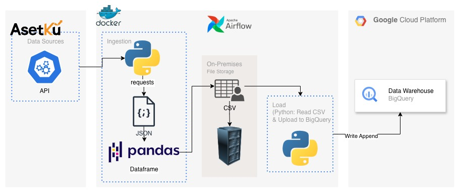

# 📊 AsetKu API Scraper to BigQuery

## 🚀 Project Description

This project implements an automated data pipeline (ETL - Extract, Transform, Load) designed to scrape data from the AsetKu API, process it, and load it into Google BigQuery (GBQ) for downstream analysis and reporting.

The pipeline is orchestrated using **Apache Airflow** and containerized with **Docker** to ensure a consistent and reliable execution environment.

## 🏗️ Data Architecture

Below is the workflow diagram for this data pipeline:



### Workflow Breakdown

1.  **Extract (Data Ingestion):**
    * A Docker container executes the Python script.
    * The script uses the `requests` library to call the AsetKu API and fetch raw data.
    * Data is returned in JSON format.
2.  **Transform & Staging:**
    * The JSON data is processed and converted into a Pandas DataFrame.
    * The DataFrame is exported and temporarily stored as a **CSV** file on the **On-Premises File Storage**.
3.  **Load (Data Loading):**
    * A separate Python script is executed (likely as an Airflow Task) to read the CSV file from the Staging area.
    * The data is uploaded to the Google BigQuery Data Warehouse using the `Write Append` mode.
4.  **Orchestration:**
    * The entire flow is managed and scheduled using **Apache Airflow**.

## 🛠️ Technologies Used

| Category | Technology | Function |
| :--- | :--- | :--- |
| **Data Source** | AsetKu API | The source of the data to be retrieved. |
| **Orchestration** | Apache Airflow | Schedules and manages the pipeline tasks (DAGs). |
| **Data Warehouse** | Google BigQuery | The final destination Data Warehouse. |
| **Processing** | Python (Pandas) | Processing JSON data into a DataFrame and converting it to CSV. |
| **Infrastructure** | Docker | Containerization of the Python scripting environment. |
| **Staging Storage** | On-Premises File Storage (or similar) | Temporary storage for CSV files before uploading to BigQuery. |

## ⚙️ Prerequisites

To successfully run this project locally or in a production environment, you will need:

* **Python 3.x**
* **Docker**
* **Access to the AsetKu API** (with valid credentials)
* **A Google Cloud Platform (GCP) Account** with permissions for:
    * Using BigQuery (creating tables and `write/append` data).
    * A configured Service Account Key for BigQuery authentication.
* **Apache Airflow Installation** (or an existing running Airflow environment).

## 🚀 Getting Started

### 1. Clone the Repository

```bash
git clone [https://github.com/ramadiansyah/asetku-api-scraper-to-bigquery.git](https://github.com/ramadiansyah/asetku-api-scraper-to-bigquery.git)
cd asetku-api-scraper-to-bigquery
````

### 2\. Configure Environment

  * Add your AsetKu API credentials to a configuration file or environment variables (using **Airflow Connections/Variables** is highly recommended).
  * Ensure the GCP Service Account Key for BigQuery is available and configured.

### 3\. Build and Run Docker (for the Ingestion Process)

The data retrieval process is containerized.

```bash
# Build the Docker image
docker build -t asetku-ingestion .

# Run the container (example, adjust for Airflow needs)
# In production, Airflow will trigger this container.
docker run \
  -e API_KEY="your_key" \
  -v /path/to/local/storage:/app/data \
  asetku-ingestion
```

### 4\. Configure Apache Airflow

  * Copy the Airflow DAG (`asetku_pipeline_dag.py`) to your Airflow `dags` folder.
  * Create a **BigQuery Connection** in Airflow (using the Service Account JSON Key).
  * Ensure Airflow can access the *On-Premises File Storage* where the CSV files are staged.

### 5\. BigQuery Deployment

Ensure the schema of the target table in BigQuery is defined before running the data loading DAG.

  * **Dataset:** `asetku_data`
  * **Table:** `raw_transactions` (example)

